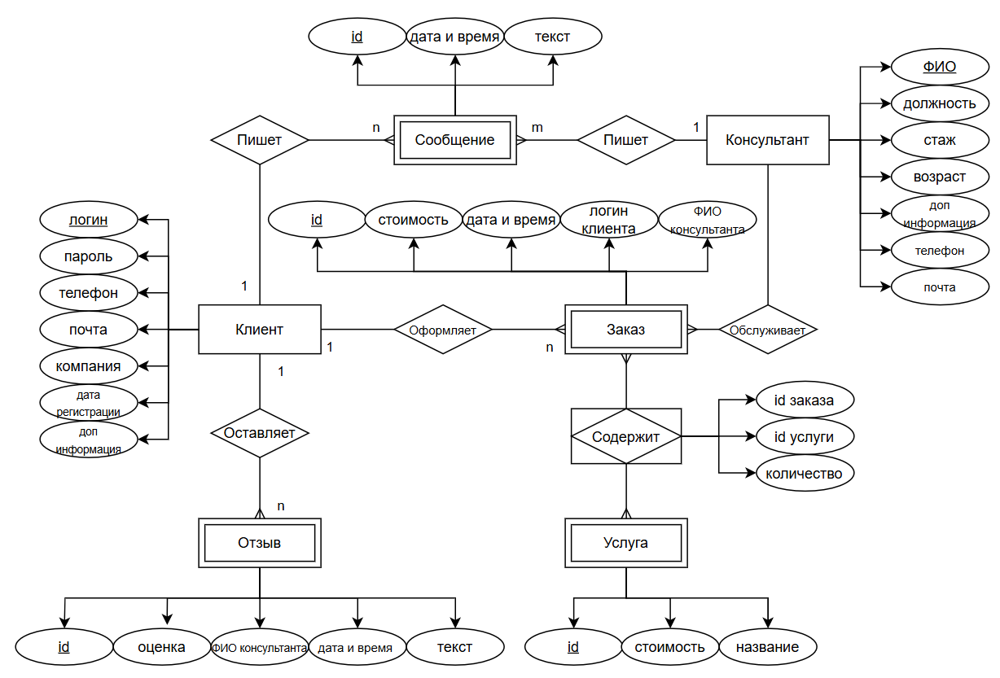

# Сайт по оказанию услуг бухгалтерского сопровождения

## Описание идеи проекта

Идея проекта заключается в том, чтобы помочь новой компании расширить клиентскую базу и прорекламировать собственные услуги. Для этого было принято решение написать web-приложение для бухгалтерского сопровождения. В его задачи будет входить информирование и консультирование клиентов о спектре услуг, тарифах и предложениях компании.

## Краткое описание предметной области

Современный бизнес нуждается в качественной бухгалтерии. Компании все меньше привлекают в свой штат бухгалтеров. Дешевле и менее трудозатратно делегировать эти обязанности на компании аутсорсинга, в которых уже имеются высококвалифицированные специалисты, способные бесошибочно рассчитать стоимость тех или иных услуг.

## Анализ аналогичных решений в предметной области

|Критерий|optimal-buh|cfunalog|moedelo|moy-buhgalter|Наш сайт|
|--------|-|--------|---------|----------|-----|
|Бесплатная консультация|+|+|+|+|+|+|
|Калькулятор рассчета предварительной стоимости услуги|+|-|-|-|+|
|Перечень услуг с расценкой|+|+|+|+|+|
|Услуги сотрудничества|+|+|+|-|+|
|Личный кабинет с анализом ведения финансовой хоз. деятельности|-|-|-|-|+|
|Отзывы|-|+|-|+|+|
|Онлайн-чат со специалистом|+|-|+|-|+|
|Чат со специалистом в вк/тг/ва|+|+|+|+|+|

## Краткое обоснование целесообразности и актуальности проекта

Целесообразность проекта определяется высоким спросом на профессиональные бухгалтерские услуги в условиях современной экономики. Наличие информативного и удобного сайта позволит эффективно донести до потенциальных клиентов информацию о предлагаемых услугах и уникальных преимуществах компании, а онлайн-платформа обеспечит доступность услуг для широкой аудитории, что увеличит шансы на привлечение клиентов в условиях конкуренции.

## Краткое описание акторов

* Гость — неавторизованный пользователь, у которого есть возможность читать информацию, предоставленную на сайте, пользоваться калькулятором и чатом.
* Клиент — авторизованный пользователь, у которого есть все возможности гостя, а также есть возможность оставлять отзывы, оформлять заказы и анализировать свои расходы.
* Администратор — специалист, публикующий информацию о новых услугах и регулирующий стоимость уже существующих.
* Консультант — специалист, следящий за поступившими заказами и отвечающий на сообщения пользователей.

## Use-Case диаграмма

## ER-диаграмма сущностей

## Пользовательские сценарии

### Сценарий с регистрацией нового пользователя

1. Гость открывает сайт магазина
2. Гость нажимает кнопку регистрации
3. Гость заполняет личные данные
4. Проверка существования пользователя в БД
5. Создание нового пользователя
6. Автоматическая авторизация

### Сценарий с обслуживанием заказа

1. Клиент выбирает услуги
2. Клиент оформляет заказ
3. Клиент оплачивает заказ
4. Консультант принимает заказ
5. Консультант выполняет заказ
6. Консультант отправляет ответ на почту

### Сценарий с добавлением отзыва

1. Клиент нажимает кнопку «оставить отзыв»
2. Клиент выбирает обслуживающего его консультанта
3. Клиент ставит оценку работе консультанта
4. Клиент пишет отзыв
5. Запись текста отзыва в БД
6. Вывод отзыва на главную страницу сайта

## Формализация ключевых бизнес-процессов

### Сценарий с обслуживанием заказа

### Сценарий с регистрацией нового пользователя

### Сценарий с добавлением отзыва

